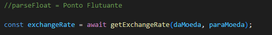

# conversor_moeda_API 🪙

## **📖 Introdução**
Este projeto é um conversor de moeda em tempo real. Ele utiliza uma API para fornecer dados sempre atualizados sobre as taxas de câmbio. A API foi obtida através do site[ExchangeRate-API](https://app.exchangerate-api.com). Atualmente, o conversor suporta apenas três moedas: Dólar (USD), Euro (EUR) e Real (BRL). No entanto, futuras atualizações poderão incluir mais moedas, proporcionando uma maior diversidade de opções.

## **⚙️ Funcionalidades**
* Entrada de Valor:
O usuário terá a opção de inserir o valor que deseja converter.

* Conversão em tempo real:
O sistema realiza a conversão de moedas utilizando uma API de câmbio (definida no código através da ExchangeRate-API), garantindo que o valor convertido exibido seja sempre o mais atualizado, de acordo com a moeda selecionada pelo usuário.

* Seleção de Moedas:
O sistema permitirá ao usuário selecionar a moeda de origem e a moeda de destino a partir de uma lista de opções, incluindo Dólar, Euro e Real.

* Reset:
O usuário terá a opção de ajustar o valor e as escolhas de moedas para efetuar uma nova conversão

* Exibição de Resultados
Após a conversão, o resultado será exibido ao final do formulário, indicando a moeda selecionada, o valor convertido e a taxa atualizada em tempo real.

## **📖 Explicação de código JavaScript**
 
**1. Conectando a API ao Código**
 
No início do código já temos duas `const` que pegam a `APIKey` que é única para cada usuário e é disponibilizado pela **API** escolhida no meu caso é a **[ExchangeRate-API](https://app.exchangerate-api.com)** e também outra `const` que pega o **Link que é a URL** da **API**.
 
**2. Consulta a taxa de câmbio via API**

* Aqui o código cria uma função assíncrona chamada `getExchangeRate` que busca a taxa de câmbio entre duas moedas específicas que serão indicadas pelo usuário a `daMoeda` e `paraMoeda`.
 
* Adiante, o código cria um bloco `Try-catch` e ele é utilizado para para lidar com os erros de uma forma segura. Isso permite capturar erros de execução e evitar que o programa trave.
 
**Requisição a API**

* A linha `const response = await fetch(${apiURL}${daMoeda});` faz uma requisição à API, concatenando o `apiURL` com a moeda de origem.
* `await` faz com que a função pause até que a resposta da API seja recebida.
 
**Processamento dos dados**
 
 
* A `const data = await response.json();` converte a resposta da **API** em um objeto **JSON** para que os dados possam ser acessados em **JavaScript**.
 
**Validação do resultado**
 
* O código verifica se a propriedade `result` no objeto `data` é igual a `"success"`. Isso indica que a **API** retornou dados válidos.
 
**Retorno da taxa de câmbio**
* Se a resposta foi bem-sucedida, a função retorna a taxa de câmbio para a moeda de destino `(data.conversion_rates[paraMoeda])`.
 
**Tratamento de erro**
* Se o valor de `data.result` não for `"success"`, a função lança um erro com a mensagem **"Erro ao buscar taxa de câmbio"**.
* O bloco `catch` captura esse erro e o exibe no **`console`**, retornando `null` para indicar uma falha na obtenção da taxa.
 
 

**3. Obtem a consulta da API e faz os cálculos**
Esse código adiciona um evento de submissão ao formulário de câmbio com o **ID** `currency-form`. Quando o usuário submete o formulário, ele impede o envio padrão e processa a conversão da moeda usando uma função assíncrona. Vamos analisar o código em partes:
 
 
**Configuração do Evento**

 
* O código usa `addEventListener` para ouvir o evento `submit` no formulário com o **ID** `currency-form`.
* `event.preventDefault()` impede que o formulário seja enviado para o servidor e recarregue a página. Em vez disso, a função que segue é executada.
 
**Obtendo Valores de Entrada**

 
* O código obtém os valores digitados pelo usuário:
* `valor`: valor a ser convertido, obtido a partir do campo de entrada com **ID** `amount`.
* `daMoeda`: moeda de origem da conversão, obtida do campo `daMoeda`.
* `paraMoeda`: moeda de destino, obtida do campo `paraMoeda`.
* `parseFloat` é usado para converter o valor de entrada para um número decimal (ponto flutuante).
 
**Obtendo a Taxa de Câmbio**

 
 
* A função `getExchangeRate`, chamada com `await`, retorna a taxa de câmbio entre `daMoeda` e `paraMoeda`.
* `await` faz com que o código espere a resposta da função assíncrona antes de continuar.
 
**Calculando e Exibindo o Resultado**
 

 
* Se `exchangeRate` é válido, o valor convertido é calculado multiplicando o valor inicial pela taxa de câmbio.
* `convertedValue.toFixed(2)` formata o valor convertido para duas casas decimais.
* O elemento com **ID** ``conversao`` exibe o resultado no formato: Resultado: ``<valor convertido> <paraMoeda>``.
 
**Tratamento de Erro**
 
* Se `exchangeRate` for `null` (indicando um erro ao buscar a taxa de câmbio), o código exibe uma mensagem de alerta ao usuário.
 
 

## **🔎 Referência**
[Mdn Web Docs](https://developer.mozilla.org/pt-BR/)
 
 
## **📡 Link da API Utilizada nesse Projeto**
 
[ExchangeRate-API](https://app.exchangerate-api.com)
ExchangeRate-API - Sign In
Sign in to your ExchangeRate-API account & dashboard.
 
## **🔭 Tecnologias ultilizadas:**
 * HTML
* CSS
* JavaScript
 
 
 

